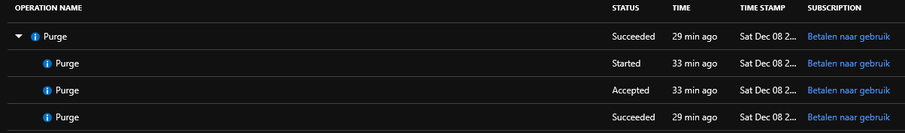
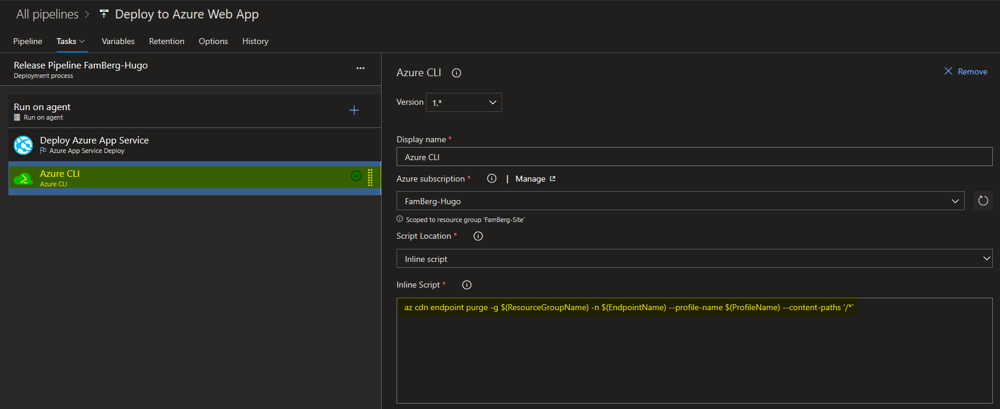
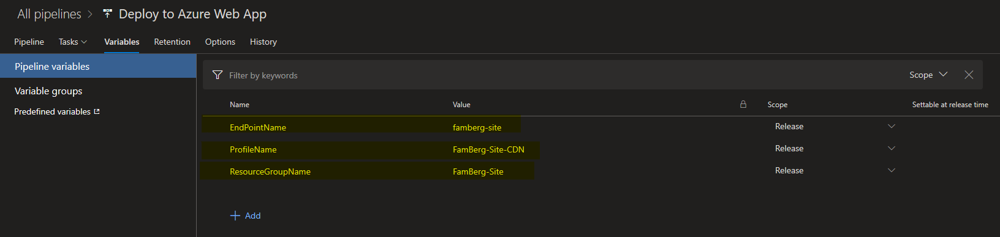

## Purge CDN content with Azure CLI in your DevOps CI/CD for Hugo

After your Azure DevOps CI/CD Pipeline has finished you want that you Azure CDN content get purged so your blog visitors will see the latest content and changes you have made to your blog.

I was searching on the internet with my best friend google and post how you can do this with PowerShell but then I was thinking why not using Azure CLI with AZ.

So found that you can use the following command:

```CLI
az cdn endpoint purge -g $ResourceGroupName -n $EndpointName --profile-name $ProfileName --content-paths '/*'
```

So tested this in the Azure Cloud Shell to look if this worked, and after some time the command was finished. So I looked in the log in the Azure portal and did see the following:



Then i added a new task in the Release Pipeline of my DevOps project for Hugo to purge the CDN endpoint for my blog site.



And added the variables for ResourceGroup, ProfileName, and EndPointName in the Release Pipeline.


