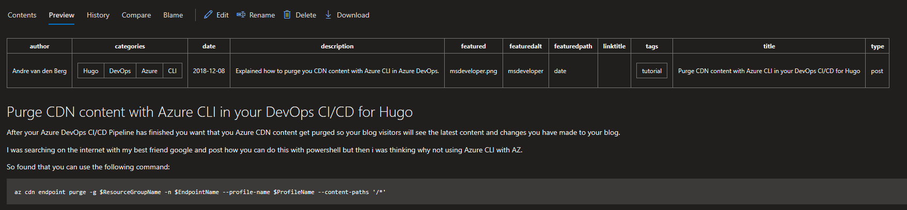

## Convert you Hugo content from TOML to YAML

When you are using Azure DevOps and go in the portal to your REPO and look at the content you will see that DevOps doesn't recognize the TOML format. But when you switch it to YAML you will get a nice table at the start op de page like understanding.



With the following command you can convert your existing content to YAML:

```bash
hugo convert toYAML --output content_as_yaml
```

And look if everything is right when this is the case you can rename your current content directory to content.old and the content_as_yaml to content.

In your config.toml you have to put the line:

```YAML
MetaDataFormat = "yaml"
```

Commit your changes in your DevOps REPO and push them you your DevOps REPO and your good to go.
