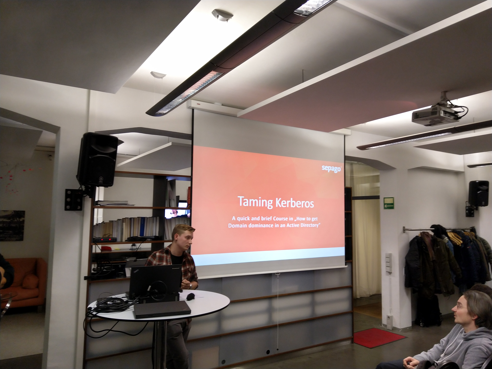
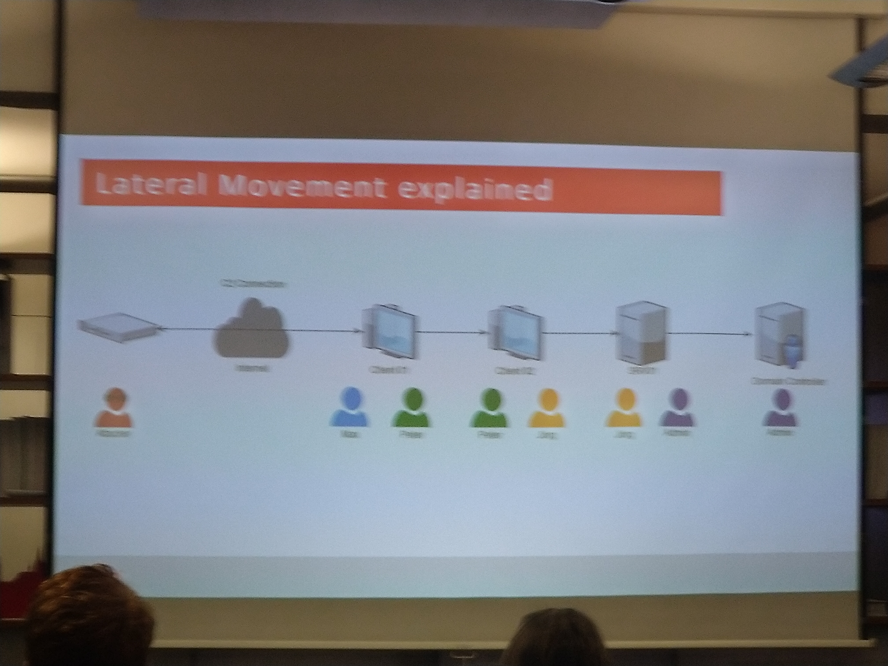
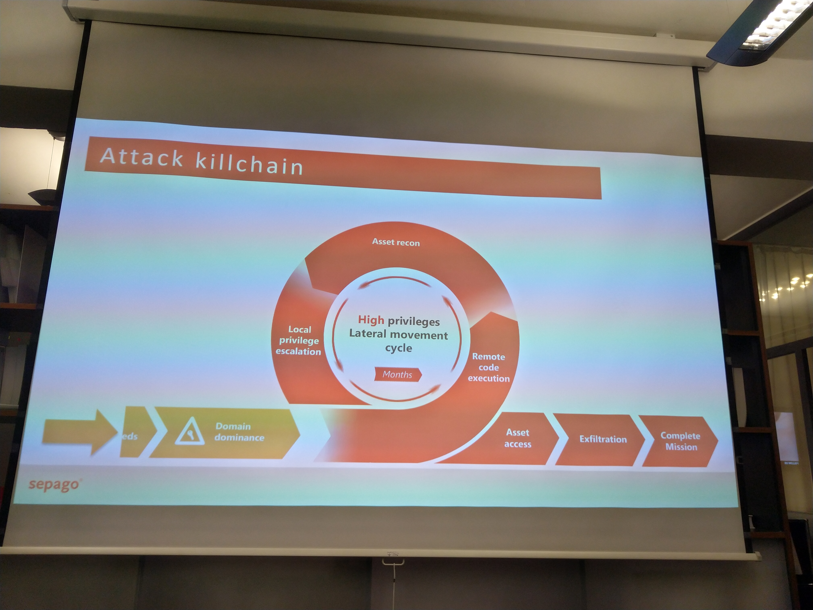
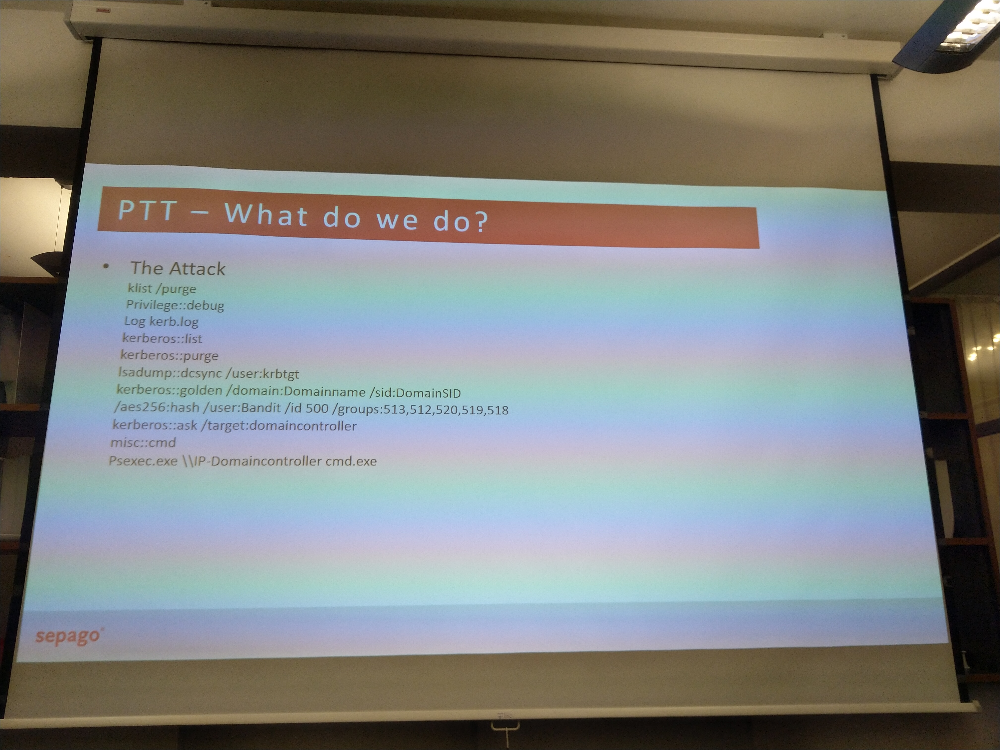

## Visited the Meetup from Trust in Tech Cologne in Koln

Was yesterday in Koln at a very interesting meetup about Active Directory Security, where they talked about the Golden-Ticket and what happens when you are attacked and penetrated. They used tools like Mimkatz to do aanADSync and do PTH (Pass the Hash).

