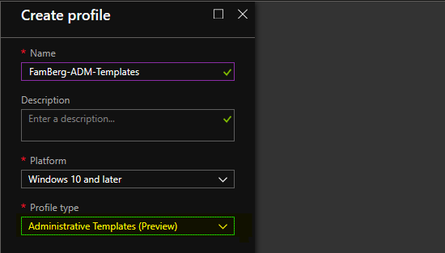
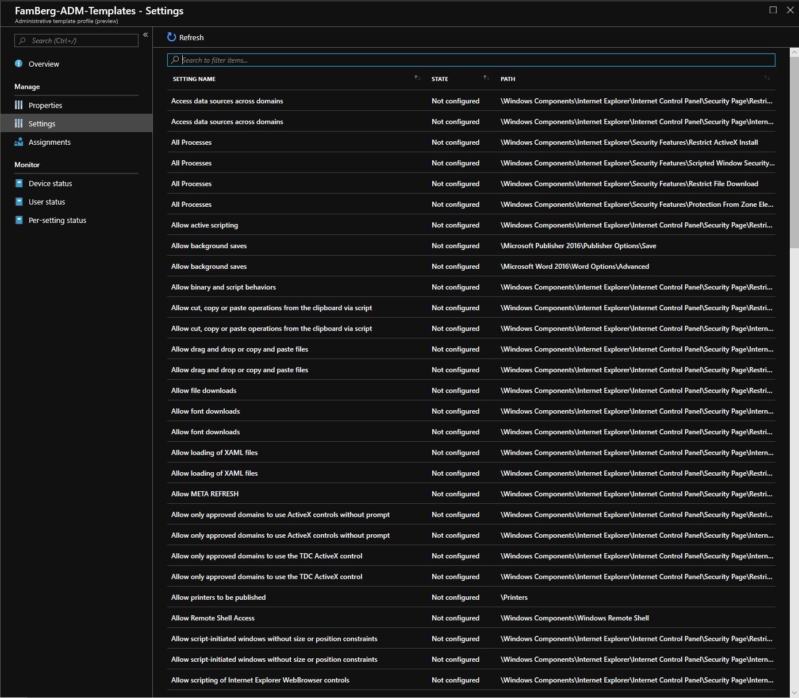
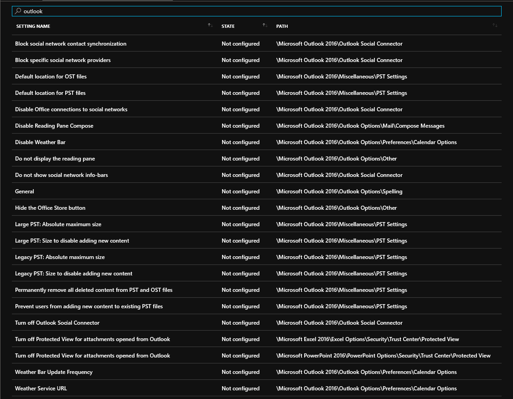
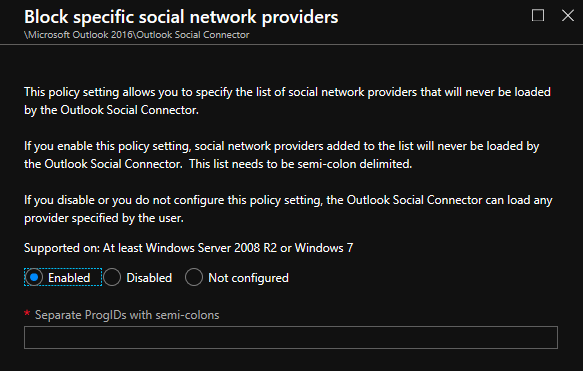
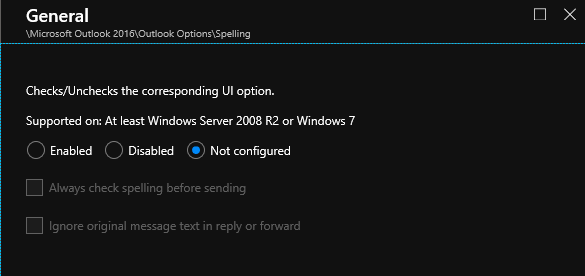
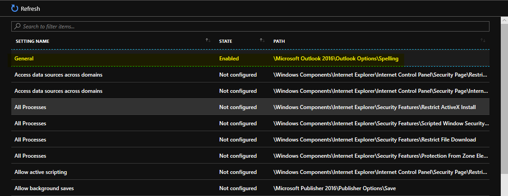

## Administrative Templates

Today see that there is a new Preview option in Azure Intune. In the Device Profile, you can configure a new type namely Administrative Templates.

Here some examples what you can configure with settings

for example outlook settings you can use the following settings

you can block social network providers with this setting.

or disable spelling.

and a setting that you have configured will put at the start off the list of all settings.

