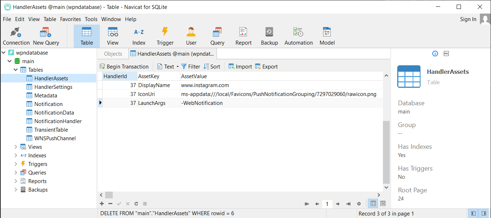

## Removing Apps from the notification list in Windows 10 Completely

Some times you want to clean up the apps that are on the notification list. You can empty the list by removing the DB file wpndatabase.db that is located in:

`C:\Users\<user>\AppData\Local\Microsoft\Windows\Notifications`

First, you have to stop the two Windows Push Notifications services like this.

    Get-Service -DisplayName  "Windows Push Notification*" | Stop-Service

Better is to rename the file to wpndatabase.db.original so you can go always back to the previous state.

    Get-Service -DisplayName  "Windows Push Notification*" | Start-Service

When you restart your computer you start with a clean list.

## Only remove one App from the notification list in Windows 10

To remove only one app from the list you have to edit the table HandlerAssets. There is a row with HandlerID that represents a notification item. In the table NotificationHandler, you can find the corresponding number with a description of the program.

With an SQLLite editor, you can view/edit the DB file with the name wpndatabase.db. I used the Navicat for SQLLite.

