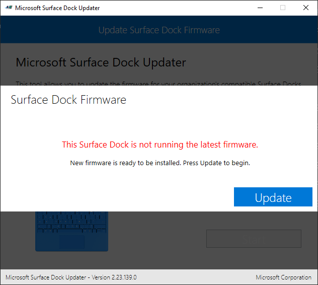

## Normally the Surface Docking Station gets it's firmware updates through Windows update

But when this is not happening you can use the surface updater tool that you can download from the following location:

[Download Updater Tool from Microsoft Site](https://www.microsoft.com/en-us/download/details.aspx?id=46703)

Select the highlighted items and download this.

After the download and install are ready we are starting the updater tools that you can find in the Start Menu at Recently Added.

As you can see is on my Surface docking station the firmware, not the latest and I run very regularly Windows Updates.

When we click on OK don't disconnect the power of the docking station or the cable connected to your surface device because this will put you Surface Docking station in an unusable state.

As seen in the previous screens you have to follow the instructions precisely or you could end up with a Surface Docking Station in an unusable state.

 On the docs.microsoft.com there is also an explanation about the updater tools at the following location:

 [Link to Surface Dock Updater](https://docs.microsoft.com/en-us/surface/surface-dock-updater)