## Enable DMARC on your Office 365 Domain with Reporting from ValiMail

In this blog, I give you the steps on how to enable DMARC en DKIM for your domain. The end also how to activate the DMARC Reporting from [ValiMail](https://go.valimail.com/microsoft.html) Many people configure DMARC and DKIM but only to monitor but then don't do anything with it further because they don't have a way to monitor what is happening.

At [docs.microsoft.com](https://docs.microsoft.com/en-us/office365/securitycompliance/use-dmarc-to-validate-email) You find a good explanation about how SPF and DMARC work together.

I am using Azure DNS to Host my domain zones, you will have four domain servers for your domain in different IP segments.

### Setup DMARC on your Office 365 tenant domain

You have to create a DNS record of the type NS in the zone of your domain like understanding for Valimail. What this will do is that says that Valimail is responsible for the dmarc TXT records for your domain.

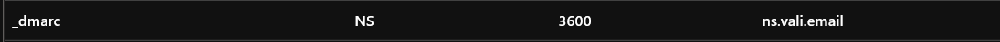

This is how it looks in DNS Editor of Azure DNS

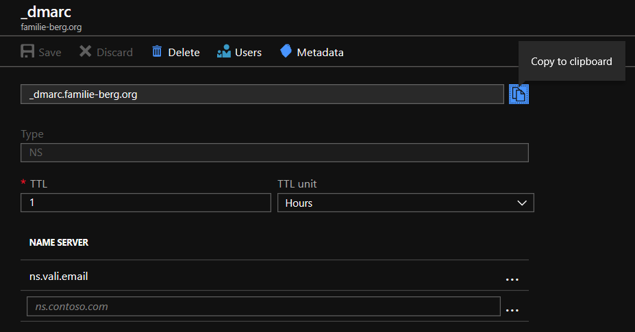

### Setup DKIM on your Office 365 tenant domain

When you are using the onmicrosoft.com domain default DKIM is already configured and you have to do nothing. When you are using your custom domain you have to configure the following two records in your domain:

```powershell
selector1._domainkey.<JOUW DOMEIN> CNAME selector1-contoso-com._domainkey.<JOUW DOMEIN>.onmicrosoft.com.
selector2._domainkey.<JOUW DOMEIN> CNAME selector2-contoso-com._domainkey.<JOUW DOMEIN>.onmicrosoft.com.
```

so will look something for my domain-like:

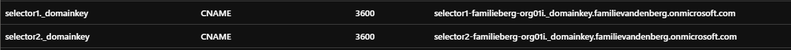

Go to [https://Portal.office.com](https://portal.office.com) and then to the Exchange portal.

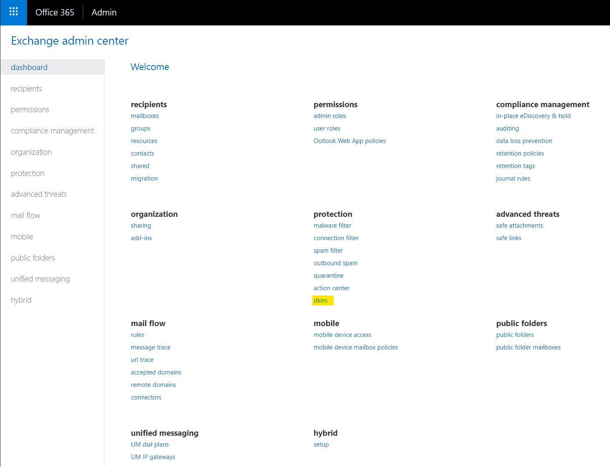

And then look at your custom domain if it is enabled else enable it.

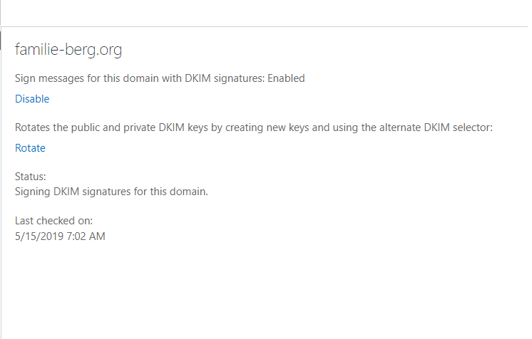

### Activate [ValiMail](https://go.valimail.com/microsoft.html) on your Office 365 Tenant domain

Go to the following URL [https://go.valimail.com/microsoft.html](https://go.valimail.com/microsoft.html) and register your domain by filling in the form.

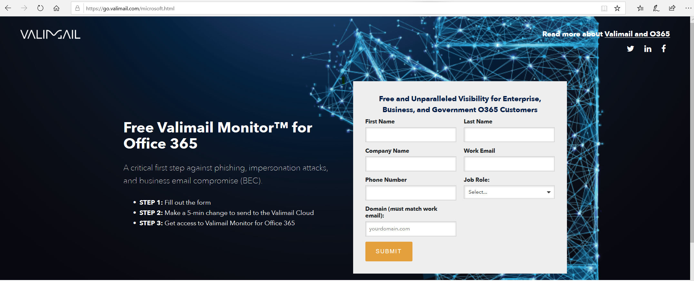

### Overview of Reporting of Valimail

When you did all the above steps and Valimail detects that you did the configuration of the DNS record in your DNS domain they will send you a mail to activate your account.

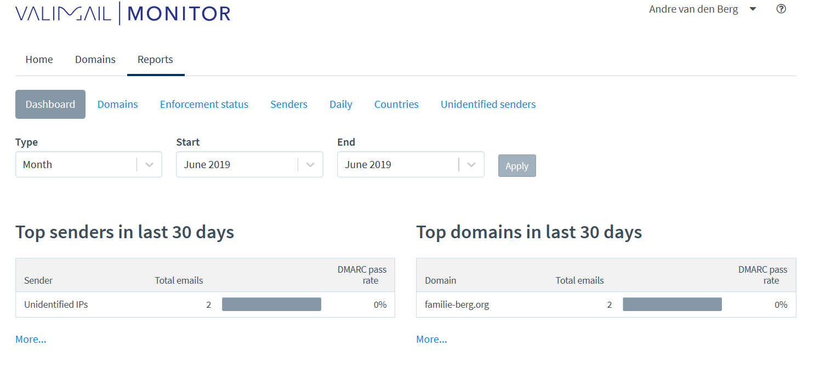

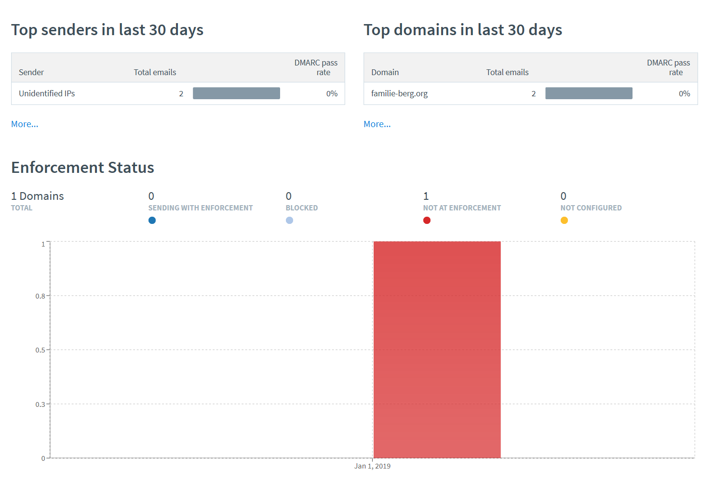

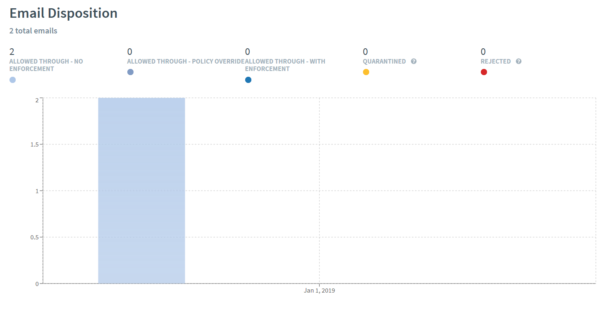

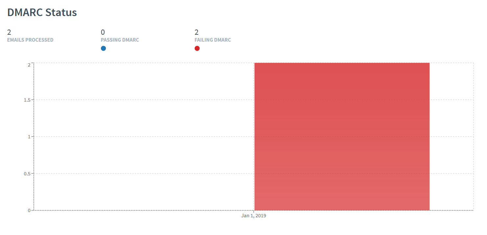

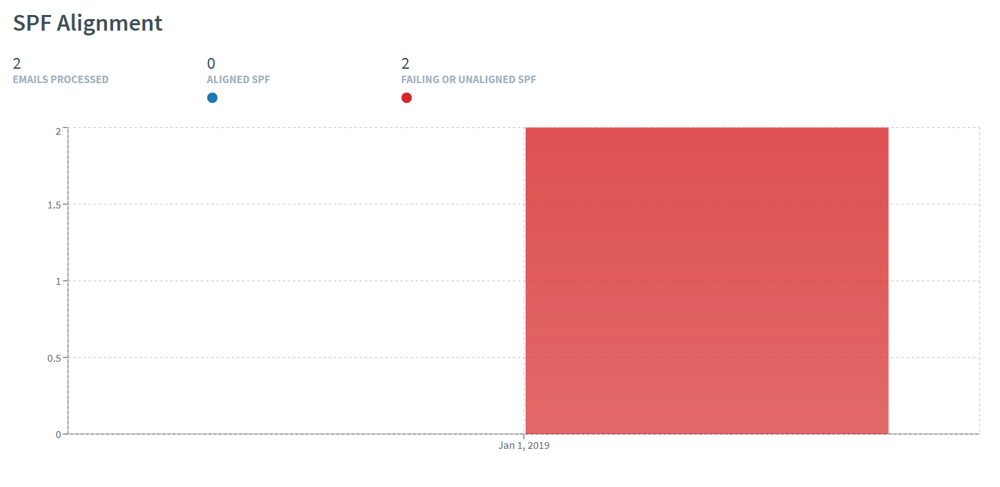

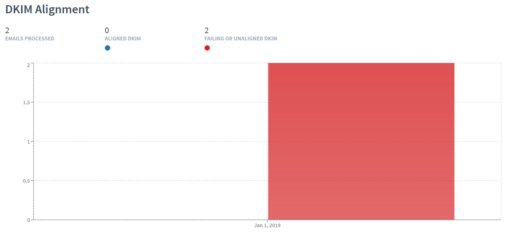