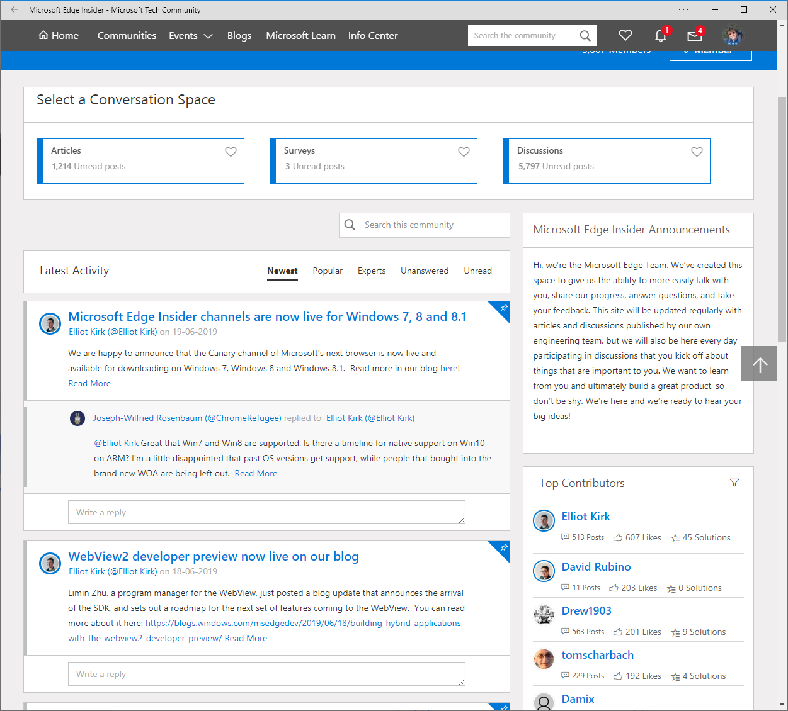

## My Edge Insider experiences

I use both the Edge Canary and Edge Dev build for some time on my work the DEV build and on my Surface Windows 10 Insider with the Canary build. I am very happy with the Edge based on Chromium because before I used daily Chrome and Firefox and now mostly only the Edge Insider build.

### Make an App from your favorite website

A cool new feature is that you can make an App from a website that you use many and pin it to the start menu or the taskbar.

When you have your website open click on the 3 dots upper right in the edge.

And then select the Apps / Install this site as an app

And then you will see the app in your windows program list.

You can then also pin the app to your Start Menu or Taskbar like other programs.

And this is how it looks when you made the [Microsoft Edge Insider](https://techcommunity.microsoft.com/t5/Microsoft-Edge-Insider/ct-p/MicrosoftEdgeInsider) site an App.

### Switch on Dark Mode

You can also switch on the dark mode in Edge DEV/CAN when you type in URL edge:/flags you get all the experimental features that you can enable. And when you type dark in the search field you will see the dark mode option.

### Only ICONS on your Favorite bar

When you have many favorites on your favorite bar you can change the setting that only the icons are shown.

As you can see now we have three favorites on the favorite bar with icon and text

When you right-click on a favorite in the favorite bar you can choose for 'show icon only' and you do this for each favorite.

As you can see we only show an icon for the first and last favorite.

