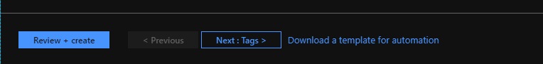

## My story why i moved my dns zones to Azure

I had my dns zones hosted at GoDaddy and then at a given moment i was thinking why not host them in Azure. Because i had problems accessing the web portal where your edit your dns records at Godaddy. So i created my dns zone for familie-berg.org in Azure with all the record that where also at Godaddy running on the dns servers. And the cost did not come above the 1 euro a month.

### How to setup your DNS Zones in Azure with the Azure DNS Services

In this part of the blog i will explain how to setup your zones in Azure with de DNS Zone service.

First i created a resource group where i could deploy the dns zone services to.

Then you go to create a resource by clicking on 'Add' when you are in the newly created resource group.

You type DNS in the search field and will see 'DNS Zone' select these

The click on 'Create' to create a new DNS Zone.

The subscription will be filled in and taken over from the resource group. And the same for the Resource group. At the INSTANCE DETAILS fill in the name of you domain that you want to host in Azure.

You now can choose to use Tags what is a very good idee to use. I will later make there also a blog about. 

But you can also choose to download a template for automation, so next time you have to create a new domain you can use the template and change settings and then deploy this.

Here is a example of the template of the domain that we created in the above steps. You can choose different languages for your template like here we choose for ARM template.

We click on the breadcrumb 'Create DNS Zone' to go back to the creation of the new dns zone.

Here we click on the create button.

And the new dns zone will be created (deployed) in our resource group we created in the above steps.

After some time the dns zone is deployed and ready for use.

And this is how it looks like. You see that microsoft has created four DNS servers four you, later in this blog you will need this information about the DNS servers when we go to configure the DNS Servers at your DNS Provider where you have registered your domain.

Now you can add new records to your dns zone.

And in the dropdown menu you have the choice of the different types of records.

You can also choose to export your dns zone to a template like in the above steps, but now also all the records you created in the Export template. This example is a ARM Template.

And here we did choose for a PowerShell template.

Second screen of the PowerShell template. As you see we had also the options for CLI and Ruby and .Net.

The nice think about hosting your dns zones in Azure is that you have also some monitoring of your zones under the monitoring menu. You can make a Chart with some metrics of your zone. I use here my e-mail domain because there is already some data in it.

You can choose a time range like 24 hours or last month or a custom range.

You can also export it to excel and do there some nice thing with it, or import it in some other systems.

Like making a chart in excel.

It's also possible to pin a chart to your dashboard.

You can choose from different types of charts, like Line, Area, Bar, Scatter and Grid.

And you can under the same monitoring menu find the option alerts, so you can configure alerts when you go over a configured threshold. 

All with all you get many more extra features that you normally not get with the standard DNS providers where you register your domain.

### Configure you dns servers at your DNS provider

Now that you have created your dns zone in Azure. You have to configure the Azure DNS servers that i have pointed out in the above steps for your DNS provider where you registered your domain.

Because i am hosting my familie-berg.org domain at GoDaddy i will use this in the below steps.

Login to GoDaddy and you will get at the place where you see all your products that you have bought from GoDaddy.

Then click on DNS button that is behind your domain that you want to change the DNS servers to the servers of Azure.

Like you see here i already did this for my domain familie-berg.org and you see that there are the four Azure DNS servers are standing. All what i did click on change and fill in the names 

 All what i did click on change and fill in the names of the Azure DNS Servers and save it.

