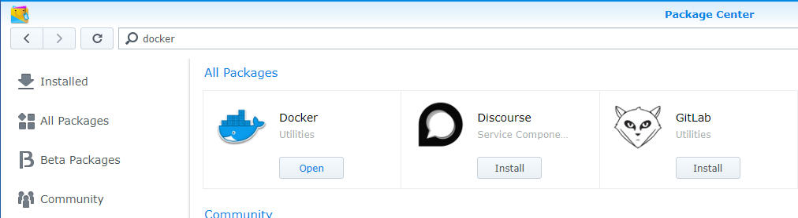
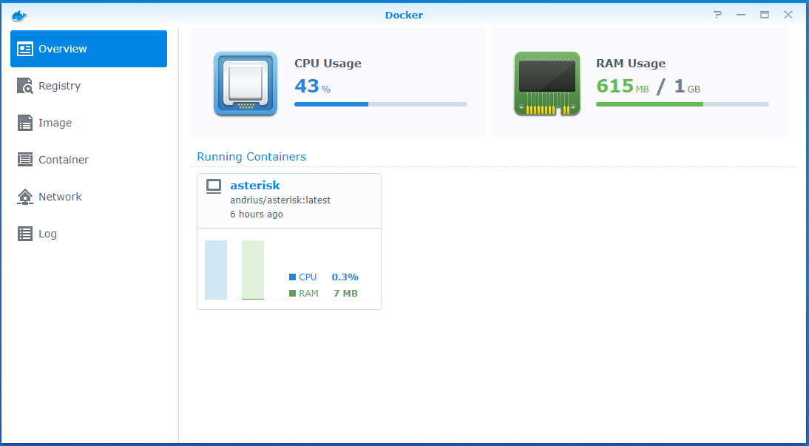
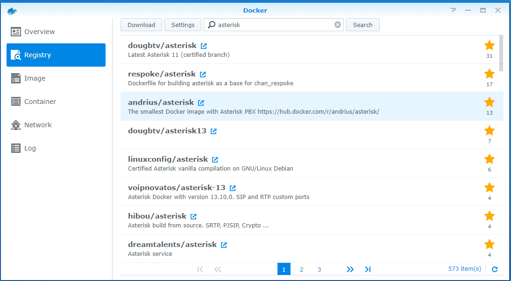
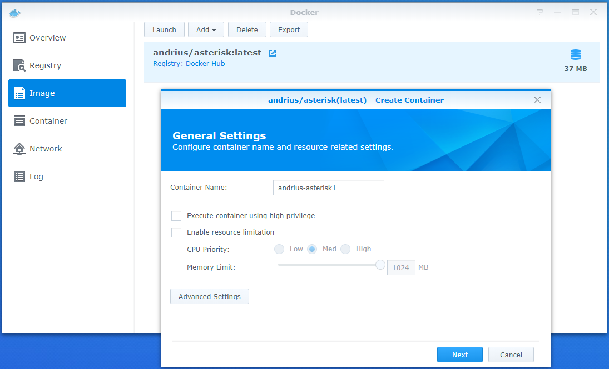
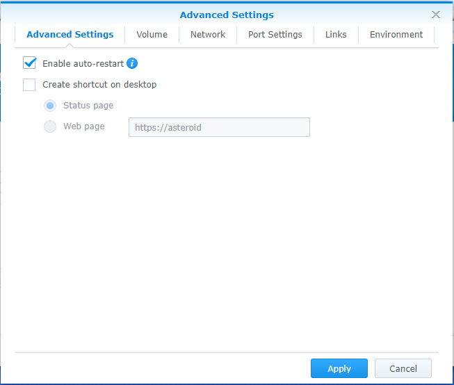
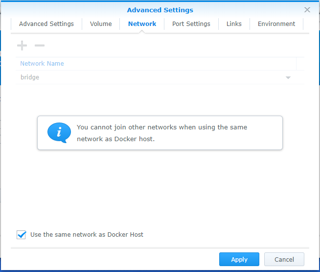
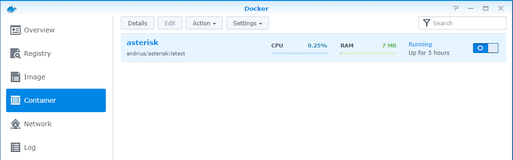
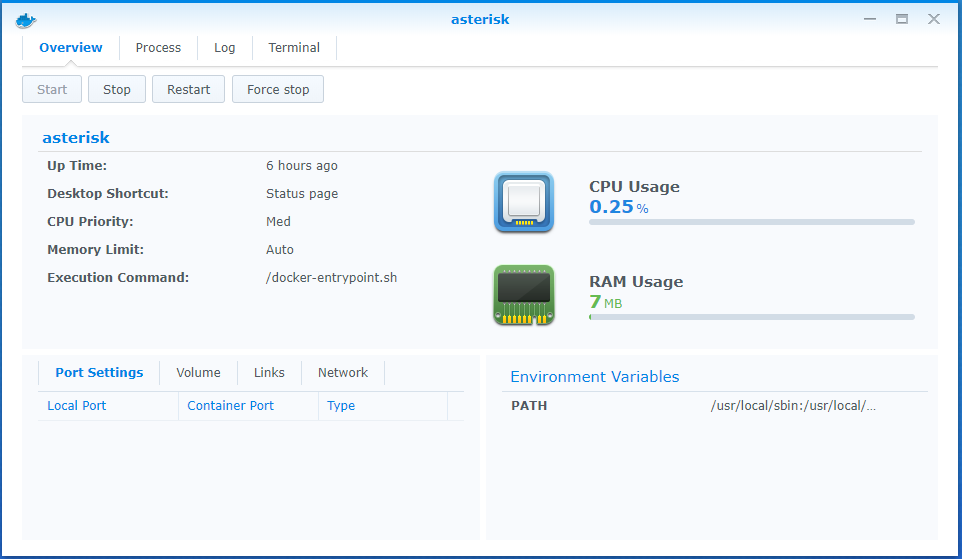
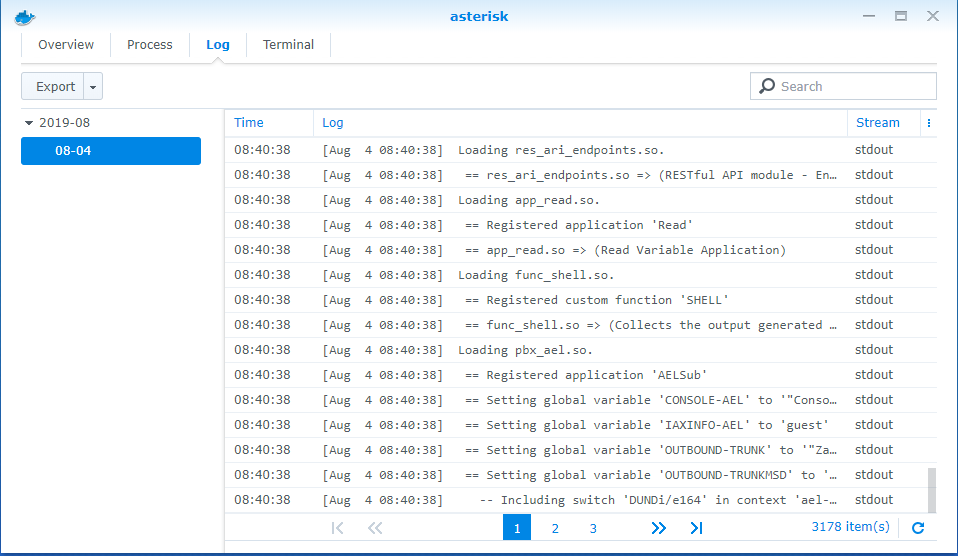
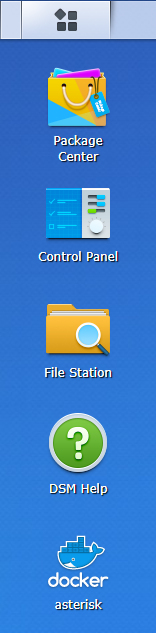

### My Synology DS712+

I was using my Synology DS712+ with DX-513 for a long time and was still running with DSM version 5.xx because I had running Asterisk also running on it. I wanted to upgrade it to DSM 6.xx but Asterisk was not supported as Package any more.

And then I heard that you can run docker containers on it with DSM 6.xx So I did copy the configuration files from the NAS to a safe place in OneDrive and upgraded the NAS to DSM 6.xx.

I have a Dutch Provider called XS4ALL and with them, you can set up a SIP Trunk.

### How to setup Docker on DSM 6.2.2

Docker is not available on all models so look at the references. Check this first before you begin with following the rest of the blog.

1. Open de Package Center and type in the search 'Docker' and you will see the Docker software with the option to install it when it's available on your model op Synology.

    

2. When the installation is ready you can open Docker from the 'Package Center' or the 'Main Menu'
    
    

3. You see here that I already installed a docker container, but when you install it for the first time there be no docker container.
    
### How to install the Asterisk image from the Registry

I used the Docker image from Andrius that is well known and updated regularly.

3. Open from the still open 'Package Center' or 'Mainmenu' Docker

    

4. So now you go to the tab 'Registry' and in the search, you type Asterisk and hit enter, now you will see several Asterisk images, I have used the one from Andrius/Asterisk. Select this one and click on download.
    
    

5. Now at the tab 'Image', you see that the image is ready and that you can create a container from it by double click on it. Here you can give it a name and then click on the 'Advanced Settings' button.
    
    

6. At the 'Advanced Settings', you can select the 'Auto-Start' option and also the 'Create shortcut on desktop'. What the last option will do is create a shortcut on the desktop where you can go fast to this container.

    

7. At the network tab, you have to select the option 'Use the same network as the docker host' When you don't do this then you have to create a bridge and all the network rules and port mappings.

    

8. When you clicked apply at step 7 you will have the screen where you see your docker container is running.

    

9. When you select the docker container that you have just created you can click on the button 'Details' and will get an overview of how many CPU and Memory your container is using.

    

10. In the tab 'log' you can see what Asterisk is doing, this is very handy when you are troubleshooting and fast want to look at what is happening.

    

11. Here you see that I have selected to create a shortcut on the desktop.

### How to configure Asterisk with SSH client or from the 'Terminal' tab of your docker container.

Because I already had my Asterisk configured and Running on DSM 5.xx I copied the information from the following files over to the docker container that we just created.\

/etc/asterisk/extensions.conf

```

[globals]
TRUNKMSD = 1  ; MSD digits to strip (usually 1 or 0)
FEATURES = 
DIALOPTIONS = 
RINGTIME = 20
FOLLOWMEOPTIONS = 
PAGING_HEADER = Intercom
trunk_1 = SIP/trunk_1
CID_trunk_1 = ====================FILL HERE YOUR MAIN NUMBER OF YOUR SIP TRUNK====================
GLOBAL_OUTBOUNDCID = 
GLOBAL_OUTBOUNDCIDNAME = 

[default]
exten = _#6XXX,1,Set(MBOX=${EXTEN:1}@default)
exten = _#6XXX,n,VoiceMail(${MBOX})
exten = a,1,VoicemailMain(${MBOX})
exten = 6011,1,VoiceMailMain(${CALLERID(num)}@default)

[ringgroups]
exten = 6400,1,Goto(ringroups-custom-1,s,1)

[DID_trunk_1]
include = DID_trunk_1_default

[DID_trunk_1_default]
exten = s,1,Goto(ringroups-custom-1,s,1)

[CallingRule_NL_VasteEnMobiel]
exten = _0XXXXXXXXX,1,Macro(trunkdial-failover-0.3,${trunk_1}/${EXTEN:0},,trunk_1,)

[CallingRule_Gemeente]
exten = _14XXX,1,Macro(trunkdial-failover-0.3,${trunk_1}/${EXTEN:0},,trunk_1,)

[CallingRule_0800en0900nrs]
exten = _0[89]00XX.,1,Macro(trunkdial-failover-0.3,${trunk_1}/${EXTEN:0},,trunk_1,)

[CallingRule_Overheid]
exten = _14XX,1,Macro(trunkdial-failover-0.3,${trunk_1}/${EXTEN:0},,trunk_1,)

[DLPN_DialPlan1]
include = CallingRule_NL_VasteEnMobiel
include = CallingRule_Gemeente
include = CallingRule_0800en0900nrs
include = CallingRule_Overheid
include = default
include = parkedcalls
include = conferences
include = ringgroups
include = voicemenus
include = queues
include = voicemailgroups
include = directory
include = pagegroups
include = page_an_extension

[ringroups-custom-1]
exten = s,1,NoOp(Allen)
exten = s,n,Dial(SIP/6001&SIP/6002&SIP/6004,20,${DIALOPTIONS}i)
exten = s,n,Hangup
```

/etc/asterisk/sip.conf

```

[general]
context = default  ; Default context for incoming calls
allowoverlap = no  ; Disable overlap dialing support. (Default is yes)
udpbindaddr = 0.0.0.0  ; IP address to bind UDP listen socket to (0.0.0.0 binds to all)
tcpenable = no  ; Enable server for incoming TCP connections (default is no)
tcpbindaddr = 0.0.0.0  ; IP address for TCP server to bind to (0.0.0.0 binds to all interfaces)
transport = udp  ; Set the default transports.  The order determines the primary default transport.
; If tcpenable=no and the transport set is tcp, we will fallback to UDP.
srvlookup = yes  ; Enable DNS SRV lookups on outbound calls
subscribecontext = default
allowexternaldomains = yes
allowguest = yes
allowsubscribe = yes
allowtransfer = yes
alwaysauthreject = no
autodomain = yes
callevents = no
checkmwi = 10
compactheaders = no
defaultexpiry = 120
domain = familie-berg.org
dumphistory = no
externrefresh = 10
g726nonstandard = no
jbenable = no
jbforce = no
jblog = no
maxcallbitrate = 384
maxexpiry = 3600
minexpiry = 60
mohinterpret = default
notifyringing = yes
pedantic = no
progressinband = never
promiscredir = no
realm = asterisk
recordhistory = no
registerattempts = 0
registertimeout = 20
relaxdtmf = yes
sendrpid = no
sipdebug = no
t1min = 100
t38pt_udptl = no
tos_audio = none
tos_sip = none
tos_video = none
trustrpid = no
useragent = Asterisk PBX
usereqphone = no
videosupport = no
nat = yes
bindaddr = 0.0.0.0
bindport = 5060
dtmfmode = inband
canreinvite = yes
externip =  =============== FILL HERE YOUR EXTERNAL IP IN ===============
localnet = =============== FILL HERE YOUR LOCAL ADDRESS RANGE IP IN ===============
disallow = all
allow = alaw,ulaw,g726,gsm

[basic-options](!); a template
dtmfmode = rfc2833
context = from-office
type = friend

[natted-phone](!,basic-options); another template inheriting basic-options
directmedia = no
host = dynamic

[public-phone](!,basic-options); another template inheriting basic-options
directmedia = yes

[my-codecs](!); a template for my preferred codecs
disallow = all
allow = ilbc
allow = g729
allow = gsm
allow = g723
allow = ulaw

[ulaw-phone](!); and another one for ulaw-only
disallow = all
allow = ulaw
```

##### References

[Used Docker Image from Andrius](https://hub.docker.com/r/andrius/asterisk)

[Used some steps from the blog of Graham Miln](https://theworklife.com/graham-miln/2017/12/06/voip-asterisk-synology-via-docker/)

[Docker available on the following models](https://www.synology.com/en-global/dsm/packages/Docker)