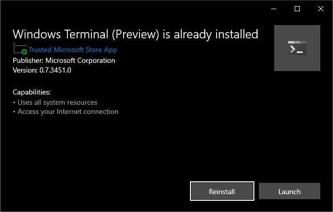

#### How will you prompt be looking like when you are finished with reading and going trough the steps in the blog

I will describe the steps to do how you can get a fancy prompt in Windows Terminal and PowerShell and also in WSL with Ubuntu. And also what to do that you get them in Visual Studio Code with PowerShell. 


#### Installing Windows Terminal

You can download the Windows Terminal from the [Microsoft Store](https://www.microsoft.com/en-us/p/windows-terminal-preview/9n0dx20hk701) the latest version at the moment when writing this blog is v0.7.3451.0.

You can also download the MSIX file from [GitHub](https://github.com/microsoft/terminal/releases) and install it by selecting the latest file here and then when it is downloaded open it.



#### For PowerShell you need Posh-Git and Oh-My-Posh

Run the following command to install the modules

> I assume you have already installed Git for Windows or on Linux for this to work.

```powershell
Install-Module posh-git -Scope CurrentUser
Install-Module oh-my-posh -Scope CurrentUser
```

When you are using PowerShell core then also install PSReadLine

```powershell
Install-Module -Name PSReadLine -AllowPrerelease -Scope CurrentUser -Force -SkipPublisherCheck
```

Then run the following command to load it every time when you start PowerShell.

```powershell
if (!(Test-Path -Path $PROFILE )) { New-Item -Type File -Path $PROFILE -Force }
notepad $PROFILE
```

and add the following lines to it.

```powershell
    Import-Module posh-git
    Import-Module oh-my-posh
    Set-Theme Paradox
```

#### Now configure it also for WSL/Ubuntu

The following looks the most like what we did for Windows.

Install [PowerLine-Go](https://github.com/justjanne/powerline-go?WT.mc_id=-blog-scottha) with the following commands.

```bash
sudo apt install golang-go
go get -u github.com/justjanne/powerline-go
```

add the following to your ~/.bashrc file

```bash
GOPATH=$HOME/go
function _update_ps1() {
    PS1="$($GOPATH/bin/powerline-go -error $?)"
}
if [ "$TERM" != "linux" ] && [ -f "$GOPATH/bin/powerline-go" ]; then
    PROMPT_COMMAND="_update_ps1; $PROMPT_COMMAND"
fi
```

And you will now also have the fancy prompt in your WSL Ubuntu session. See the understanding example of my WSL Ubuntu session.


#### When you get strange characters instead of the Powerline glyphs

For Windows Terminal is there now a font called [Cascadia Code](https://github.com/microsoft/cascadia-code/releases) and also Adam Cooper made a fork where the Nerd Fonts are included with Glyphs with the name [Delugia Code](https://github.com/adam7/delugia-code/releases).

With this on-liner you can download and install the last one.

```powershell
Invoke-WebRequest -Uri https://github.com/microsoft/cascadia-code/releases/download/v1911.21/CascadiaPL.ttf -OutFile .\CascadiaPL.ttf; Start-Process CascadiaPL.ttf -Wait
```

#### Use Cascadia Code PL in your Visual Studio Code for Editor and Terminal

By adding the following in your settings.json file you also get the Cascadia Code font in your Editor and Terminal of Visual Studio Code.

```json
    "git.enableSmartCommit": true,
    "git.confirmSync": false,
    "editor.accessibilitySupport": "off",
    "editor.fontFamily": "'Cascadia Code PL', Consolas, 'Courier New', monospace",
    "editor.fontLigatures": true,
    "terminal.integrated.fontFamily": "'Cascadia Code PL'",
    "terminal.integrated.shell.windows": "C:\\Program Files\\PowerShell\\6\\pwsh.exe"
```

or you can it most of it by going to File -> Preferences and change it from here.


##### References

[Blog by Scot Hanselman](https://www.hanselman.com/blog/HowToMakeAPrettyPromptInWindowsTerminalWithPowerlineNerdFontsCascadiaCodeWSLAndOhmyposh.aspx)

[Blog by Jan De Dobbeleer](https://github.com/JanDeDobbeleer/oh-my-posh)

[GitHub Repo of Cascadia Code](https://github.com/microsoft/cascadia-code/releases)

[GitHub Repo of Delugia Code by Adam Cooper](https://github.com/adam7/delugia-code/releases)