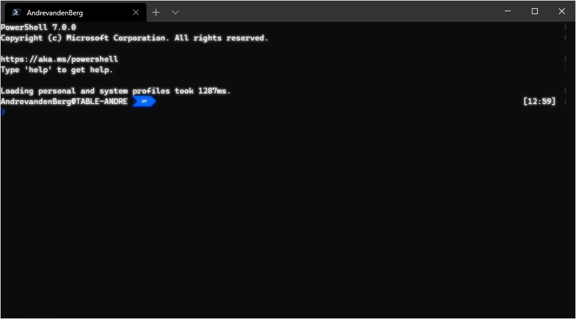

### What's new in this version

• Mouse Support (for WSL and Windows applications using ENABLE_VIRTUAL_TERMINAL_INPUT)
    o Applications running in WSL and Windows applications that use VT (instead of the traditional Win32 API) can now request mouse mode (#4848) (#4856) (#4859)
       The set of supported encodings and events is identical to that of the traditional console host.

• A new profile setting, antialiasingMode, lets you configure whether you want text to be blurry or jagged (#4711)
    o The accepted options are actually not "blurry" and "jagged", they are "grayscale", "cleartype" and "aliased"
      The default is "grayscale", because grayscale antialiasing is most compatible with alpha blending

• splitPane learned a new option, splitMode, which accepts the value "duplicate" (#4683)
    o Setting a key binding to splitMode: "duplicate" will make it open a copy of the current profile when you use it

• Resizing is so much better we decided to call it a feature, even though really it was just a hundred bugs wearing a trenchcoat (#4415) (#4741)
    o We'll also try to maintain your position in the scrollback when you resize (#4903)

### Links

[Commandline Blog](https://devblogs.microsoft.com/commandline/)

[Windows Terminal Preview v0.10.761.0](https://github.com/microsoft/terminal/releases/tag/v0.10.761.0)

[Windows Terminal Preview v0.10 Release Blog by Kayla](https://devblogs.microsoft.com/commandline/windows-terminal-preview-v0-10-release/)

### Retro terminal effect

There is an experimental option that you can activate in the settings that will emulate a retro terminal look.

```powershell
Use CTRL, to open the settings file.
```

And add the following line to you profile list item.

```powershell
"experimental.retroTerminalEffect": true
```

So you PowerShell Core it will look like understanding.

``` json
   "list": [
            {
                "acrylicOpacity": 0.5,
                "closeOnExit": true,
                "colorScheme": "Campbell",
                "commandline": "C:\\Program Files\\PowerShell\\7\\pwsh.exe",
                "cursorColor": "#FFFFFF",
                "cursorShape": "bar",
                "fontSize": 10,
                "guid": "{574e775e-4f2a-5b96-ac1e-a2962a402336}",
                "historySize": 9001,
                "icon": "ms-appx:///ProfileIcons/{574e775e-4f2a-5b96-ac1e-a2962a402336}.png",
                "name": "PowerShell Core",
                "padding": "0, 0, 0, 0",
                "snapOnInput": true,
                "startingDirectory": "%USERPROFILE%",
                "useAcrylic": false,
                "fontFace": "Delugia Nerd Font",
                "experimental.retroTerminalEffect": true
            }
   ]
```

And this is how it looks when you did everything right.



### Using profiles

You can create profiles for different terminals in Windows Terminal.

I will try to explain how this is build op within the settings.json file.

So you create lists inside profiles and within the list you specify the properties for example your 'PowerShell Core'

``` json
   "list": [
            {
                "acrylicOpacity": 0.5,
                "closeOnExit": true,
                "colorScheme": "Campbell",
                "commandline": "C:\\Program Files\\PowerShell\\7\\pwsh.exe",
                "cursorColor": "#FFFFFF",
                "cursorShape": "bar",
                "fontSize": 10,
                "guid": "{574e775e-4f2a-5b96-ac1e-a2962a402336}",
                "historySize": 9001,
                "icon": "ms-appx:///ProfileIcons/{574e775e-4f2a-5b96-ac1e-a2962a402336}.png",
                "name": "PowerShell Core",
                "padding": "0, 0, 0, 0",
                "snapOnInput": true,
                "startingDirectory": "%USERPROFILE%",
                "useAcrylic": false,
                "fontFace": "Delugia Nerd Font",
                "experimental.retroTerminalEffect": false
            }
   ]
```

You can create defaults for your list, so in understanding example we set the fontFace default to 'Cascadia Code PL' and the fontSize to '14'. When we don't define these two properties in the list i will get the defined defaults.

``` json
    "defaults": {
            "fontFace": "Cascadia Code PL",
            "fontSize": 14
    }
```

So here the complete settings.json file voor the profiles, defaults and list.

``` json
    "profiles": {
        "defaults": {
            "fontFace": "Cascadia Code PL",
            "fontSize": 14
        },
        "list": [
            {
                "acrylicOpacity": 0.5,
                "closeOnExit": true,
                "colorScheme": "Campbell",
                "commandline": "C:\\Program Files\\PowerShell\\7\\pwsh.exe",
                "cursorColor": "#FFFFFF",
                "cursorShape": "bar",
                "fontSize": 10,
                "guid": "{574e775e-4f2a-5b96-ac1e-a2962a402336}",
                "historySize": 9001,
                "icon": "ms-appx:///ProfileIcons/{574e775e-4f2a-5b96-ac1e-a2962a402336}.png",
                "name": "PowerShell Core",
                "padding": "0, 0, 0, 0",
                "snapOnInput": true,
                "startingDirectory": "%USERPROFILE%",
                "useAcrylic": false,
                "fontFace": "Delugia Nerd Font",
                "experimental.retroTerminalEffect": false
            },
            {
                "acrylicOpacity": 0.5,
                "closeOnExit": true,
                "colorScheme": "Campbell",
                "commandline": "C:\\Program Files\\PowerShell\\7\\pwsh.exe",
                "cursorColor": "#FFFFFF",
                "cursorShape": "bar",
                "fontSize": 10,
                "guid": "{b6d707fe-8737-4d43-9e14-dab6351c5165}",
                "historySize": 9001,
                "icon": "ms-appx:///ProfileIcons/{b6d707fe-8737-4d43-9e14-dab6351c5165}.png",
                "name": "PowerShell Core Retro",
                "padding": "0, 0, 0, 0",
                "snapOnInput": true,
                "startingDirectory": "%USERPROFILE%",
                "useAcrylic": false,
                "experimental.retroTerminalEffect": true
            },
            {
                "acrylicOpacity": 0.5,
                "background": "#012456",
                "closeOnExit": true,
                "colorScheme": "Campbell",
                "commandline": "powershell.exe",
                "cursorColor": "#FFFFFF",
                "cursorShape": "bar",
                "fontSize": 10,
                "guid": "{61c54bbd-c2c6-5271-96e7-009a87ff44bf}",
                "historySize": 9001,
                "icon": "ms-appx:///ProfileIcons/{61c54bbd-c2c6-5271-96e7-009a87ff44bf}.png",
                "name": "Windows PowerShell",
                "padding": "0, 0, 0, 0",
                "snapOnInput": true,
                "startingDirectory": "%USERPROFILE%",
                "useAcrylic": false,
                "fontFace": "Delugia Nerd Font"
            },
            {
                "acrylicOpacity": 0.75,
                "closeOnExit": true,
                "colorScheme": "Campbell",
                "commandline": "cmd.exe",
                "cursorColor": "#FFFFFF",
                "cursorShape": "bar",
                "fontFace": "Consolas",
                "fontSize": 10,
                "guid": "{0caa0dad-35be-5f56-a8ff-afceeeaa6101}",
                "historySize": 9001,
                "icon": "ms-appx:///ProfileIcons/{0caa0dad-35be-5f56-a8ff-afceeeaa6101}.png",
                "name": "cmd",
                "padding": "0, 0, 0, 0",
                "snapOnInput": true,
                "startingDirectory": "%USERPROFILE%",
                "useAcrylic": true
            },
            {
                "acrylicOpacity": 0.5,
                "closeOnExit": true,
                "colorScheme": "Campbell",
                "commandline": "wsl.exe -d Ubuntu-18.04",
                "cursorColor": "#FFFFFF",
                "cursorShape": "bar",
                "fontSize": 10,
                "guid": "{c6eaf9f4-32a7-5fdc-b5cf-066e8a4b1e40}",
                "historySize": 9001,
                "icon": "ms-appx:///ProfileIcons/{9acb9455-ca41-5af7-950f-6bca1bc9722f}.png",
                "name": "Ubuntu-18.04",
                "padding": "0, 0, 0, 0",
                "snapOnInput": true,
                "useAcrylic": false,
                "fontFace": "Delugia Nerd Font"
            },
            {
                "guid": "{b453ae62-4e3d-5e58-b989-0a998ec441b8}",
                "hidden": false,
                "name": "Azure Cloud Shell",
                "source": "Windows.Terminal.Azure"
            },
            {
                "guid": "{46ca431a-3a87-5fb3-83cd-11ececc031d2}",
                "hidden": false,
                "name": "kali-linux",
                "source": "Windows.Terminal.Wsl"
            }
        ]
    }
```
