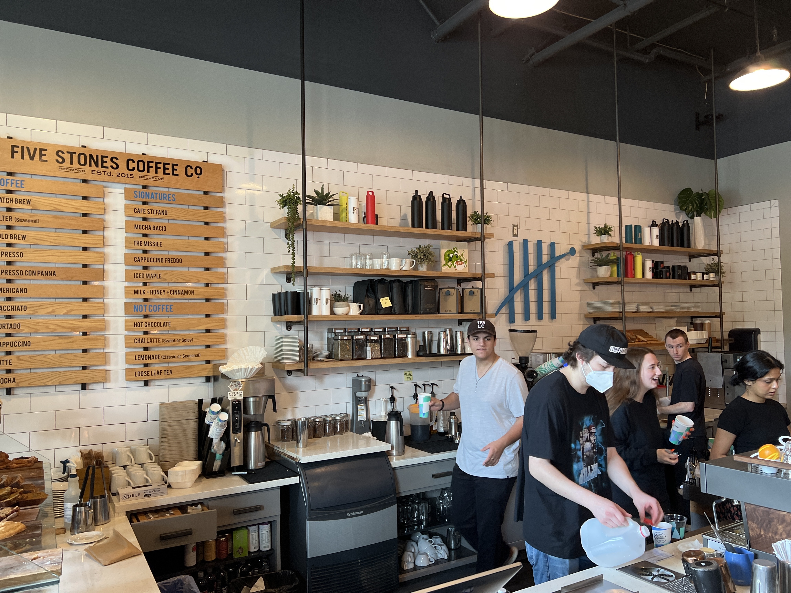
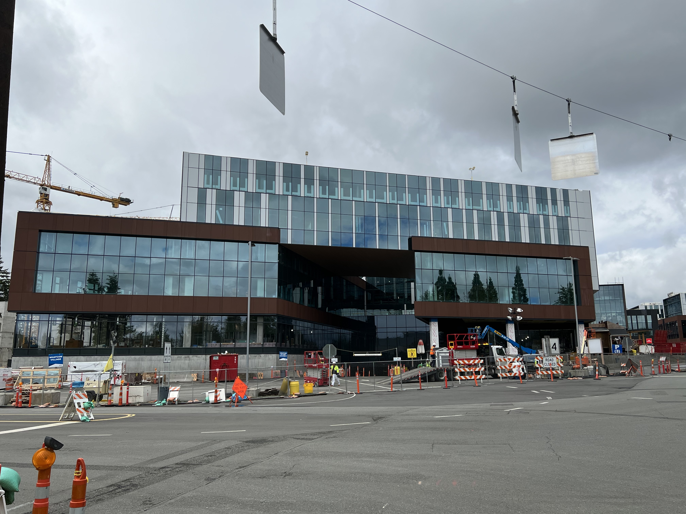

## Intro

In the morning me and [Erik Moreau](<https://twitter.com/erikmoreau>), and [Mike Halsey](https://twitter.com/MikeHalsey) where waiting for [Susan Cockrell](https://twitter.com/SusanWCockrell) to pickup us up at the Hotel.

Susan drove us to a place called 'Five Stones Coffee Co' for something to drink and eat.

## Executive Briefing Center

We stopped also at the Executive Briefing Center to take a phone with the building sign.

## New Microsoft buildings construction place

On the way to the Office Product Team building we stopped at the construction site of the new mega big building with the biggest parking space under it in the world Susan told us.

## Visiting the Office of Office Product Team

We had a meeting with [Caitlin Hart](<https://twitter.com/_caithart_>) and a colleague of her to talk and give feedback about New Outlook.

## Visited the Tree Houses

After the meeting we visited the Tree Houses near the building of the Office Product Team.

After that we did eat some pizza at the Microsoft canteen and met Paula a friend of Mike from Microsoft that was so kind to bring us to the airport in Seattle.

## Conclusion

Had a awesome week and looking forward to the next time to visit the Microsoft Campus.

Want to thank everyone from Microsoft that was so kind and friendly.
