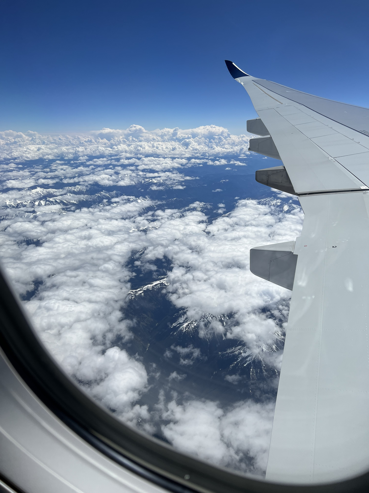
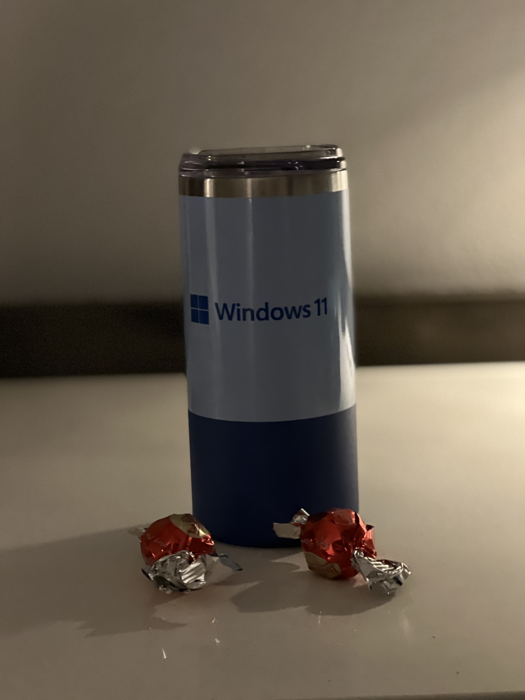

### Intro

Driving to Amsterdam Airport Schiphol and checkin and then did head over to the security, there was a queue but was doable. Erik Moreau was already waiting for me, and we boarding the plane together to Seattle. After little more then 9 hours we arrived in Seattle airport and take a UBER to the hotel in Redmond.

### Visiting Build 109

We had send a DM on the plane to Kayla Cinnamon to meet, so after we checked-in the Hotel we take a Uber to Build 109 where the Windows Terminal team is located. We had a nice meeting with also Clint from the PowerToys team. But can't tell anything because it's all on NDA.

### Conclusion

When we came back to the hotel there was a nice surprise on the hotel room from the Microsoft WCCP Summit 2022.

