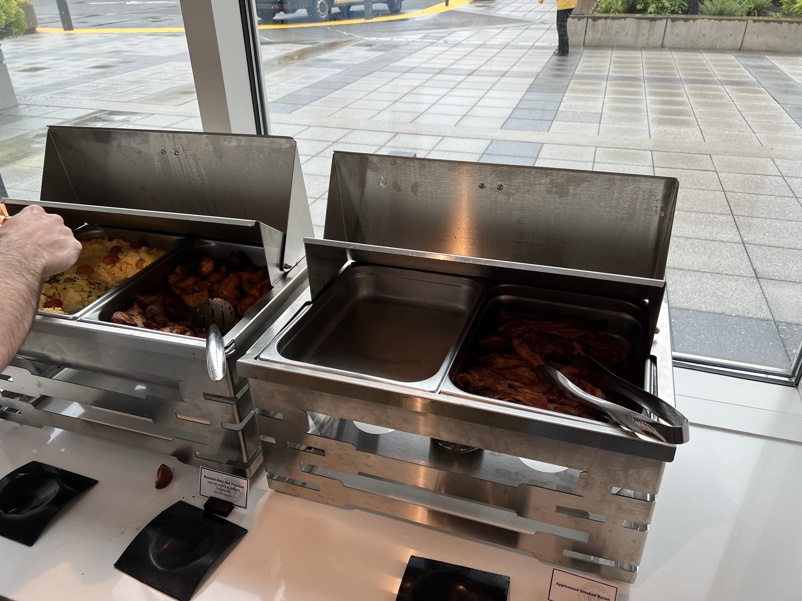
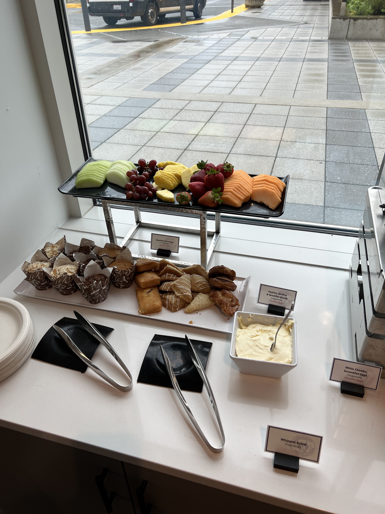

## Intro

I the morning we go with the shuttle bus to Microsoft campus from the Hotel.

## WCCP Summer Summit 2022

We started the morning with breakfast with bacon, potatoes, and scrambled egg and fruits and some tasty sweets.

and [Steve Dispensa](<https://twitter.com/dispensa>) opened the day before the session with Edge Team, Universal Printer Team.

## Shopping in Bellevue, WA

After the sessions we do go back to the Hotel with the shuttle bus, and drive together with Steve one of the other attendees to Bellevue and did there some shopping and drink and eat some in the Travern Hall.

And then back to the Hotel again.

## End of Day

Next morning we will have a meeting with Team of New Outlook together with [Susan Cockrell](https://twitter.com/SusanWCockrell).

Now going to sleep.
