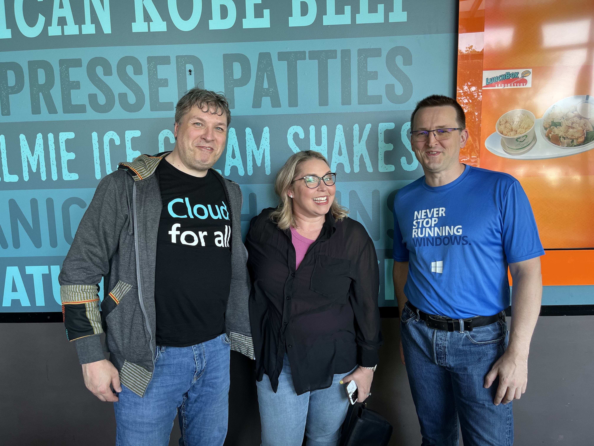

### Intro

At the begin of the day we got picked up at the Hotel in Redmond and go to the WCCP Summer Summit where we did have breakfast en then multiple sessions. 

## Sessions

The day was opened by [Steve Dispensa](<https://twitter.com/dispensa>) and then we had an couple of other sessions.

## Dinner

After the sessions ended in the afternoon we got to go a place called Lunchbox where we meet [Susan Cockrell](https://twitter.com/SusanWCockrell) from the Office Insiders

She did take some stickers and awesome office insider socks and Base Caps for us.

After that did by something in shop for home and go back to the Hotel where we sit some in the Bar of the Hotel.
