## My story about the Microsoft Surface Devices

I love the Surface devices, My first surface device was a Microsoft Surface Pro 3, and I am still using it to test the Windows Insider dev builds on it. The Surface Pen I love also and use many when I fast want to draw some thing or when I have to put my Sign on a official document that I have to send somewhere.

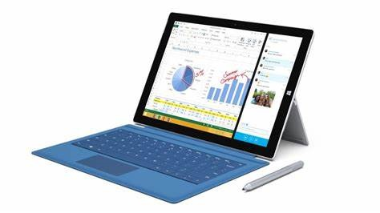

And love the Docking for the Surface Pro 3 where you could put your device in and have all external devices like screen, keyboard, mouse and printer connected to.

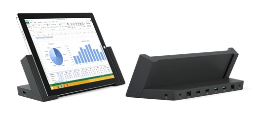

## Surface Book

The Microsoft Surface Book was my second device that I used and loved, with a real full size keyboard and the display that you could detach, liked this device because I looked and feel like a laptop.

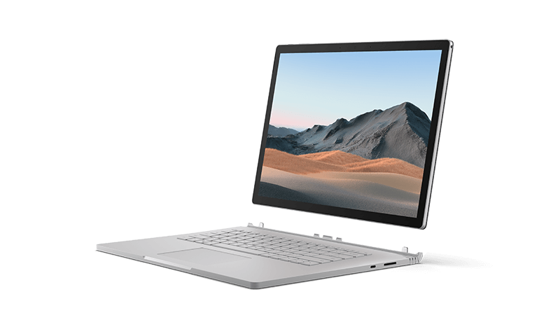

## Surface Docking

The Surface Docking is very handy because I can connect my two external monitors to it, one is a Dell 32" Curved 4K and the other a 27".

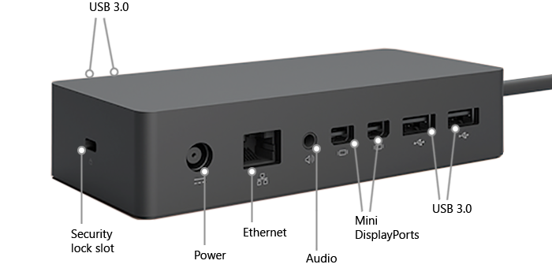

## Microsoft Band

I had for some time also a Microsoft Band and loved it very much pithy that Microsoft cancelled the production of it. Because after some time the band broke.

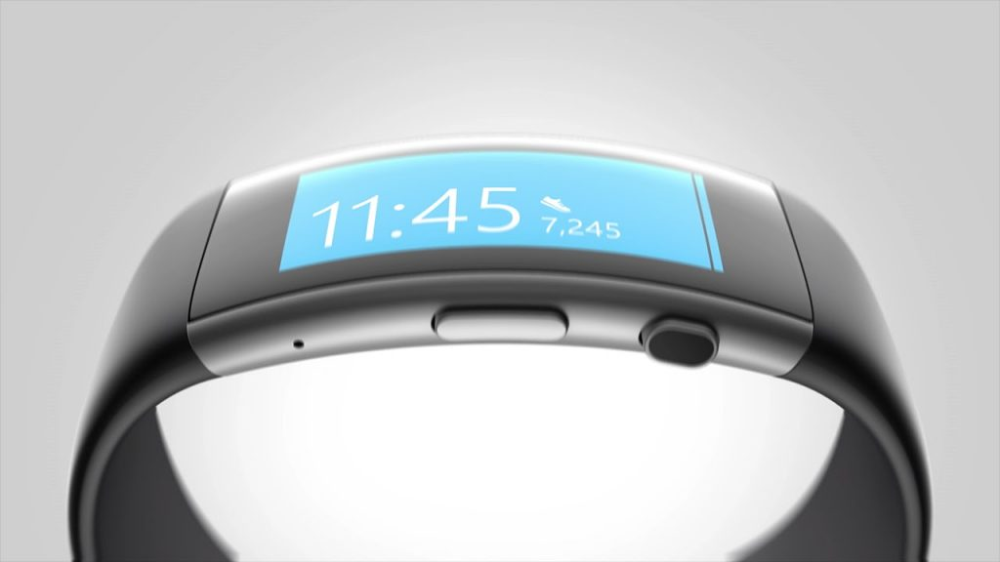

## Surface Go

Then my third device was a Surface Go, I did choose the little bit more expensive model that perform better than the cheaper one, and liked it very much, take it still with me next to my Surface Book 3 device that i use as my daily driver.

The size of the surface Go is extremely handy, also when I am on events.

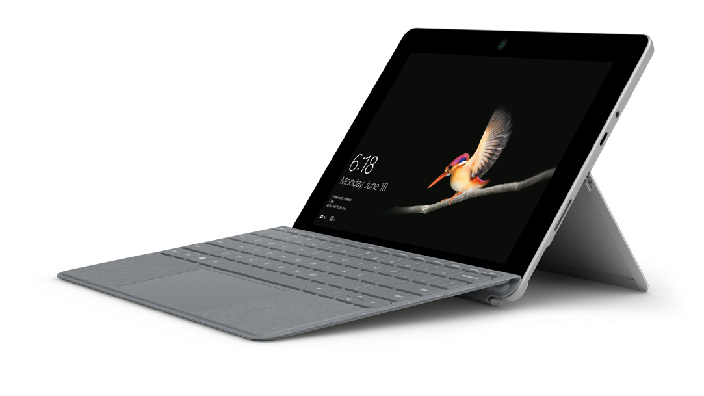

## Surface Headphones

Then I wanted to have a Surface Headphones when I was sitting many time on the phone, and Love the Surface Headphones with their noise cancelling in it. This year when I went to Microsoft Campus in Redmond I put them on in the plane and used the noise cancelling and did sleep some with the noise cancelling on maximum.

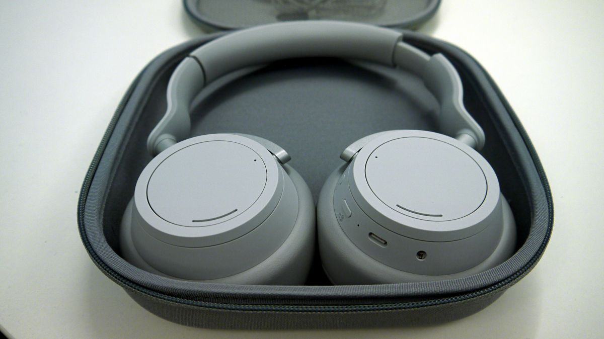

## Surface Earbuds

Then Panos announced the Surface Earbuds on the Surface yearly event and off course I ordered the Surface Earbuds, they are lightweight and easy to put in your ears

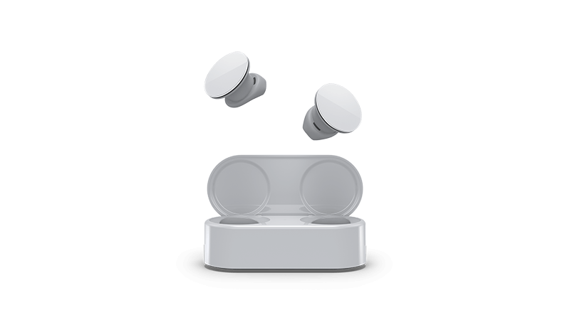

## Surface Book 3

At a given moment my Surface Pro 3 was not fast enough anymore with Microsoft Teams and I wanted something new, there was again a new Surface Event with Panos and they announced the Surface Book 3, so I pre-ordered it and after some months waiting it arrived.

I did order the one with 15" screen and a Core i7 with 512 gb off storage and 32 gb memory.

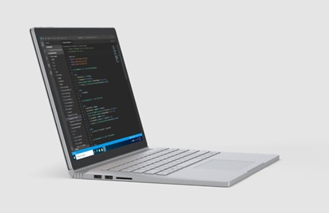

## Surface Headphones 2

When the new Surface Headphones 2 came available I ordered them right away because they where now Teams Certified and have a Teams button. My girlfriend is now using my Surface Headphones on her Surface Pro 4 and she loves them very much.

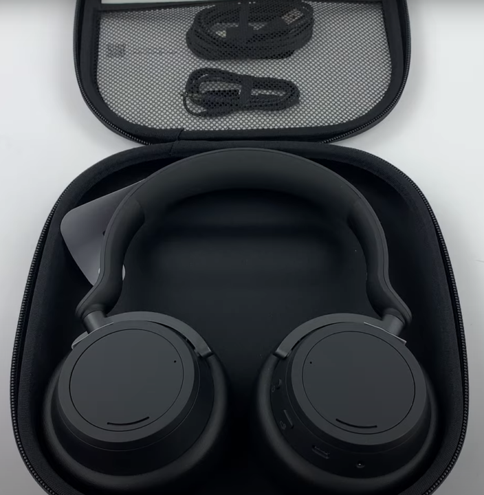

## Surface Keyboard and Mouse

Some time ago I ordered a Surface Keyboard and Mouse and use them daily, even take them with me when I go to a customer or the office.

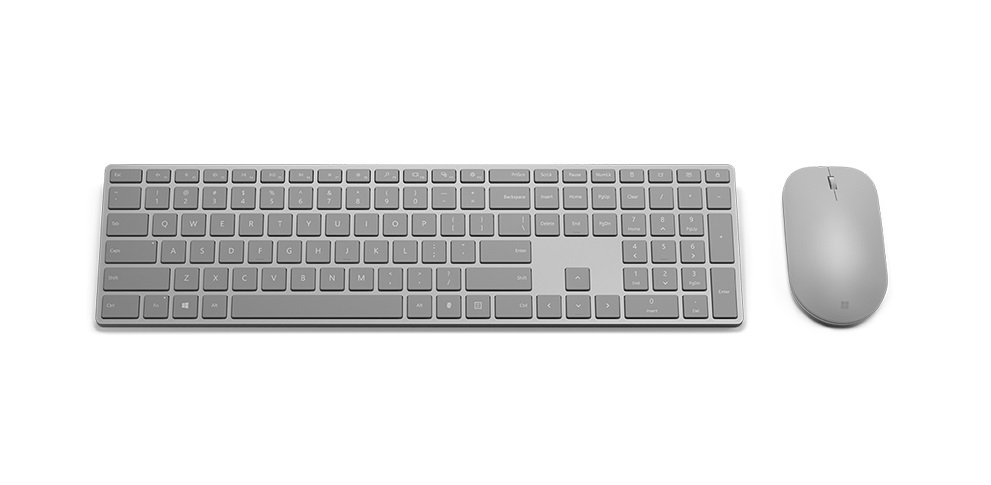

## Microsoft Modern USB-C Speaker

With last Christmas I presented myself a Microsoft Modern USB-C Speaker that is teams Certified. The sound is awesome and the cable is nicely put away on the edge of the speaker and there is a nice case with it in the style of the Surface Headphones.

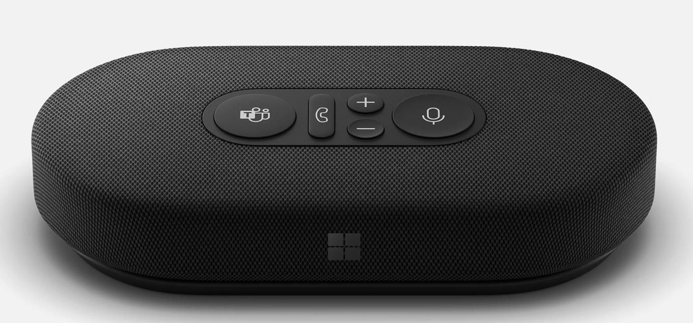

## Surface USB-C Travel Hub

It's very handy because you have all the different option with you while you are traveling.

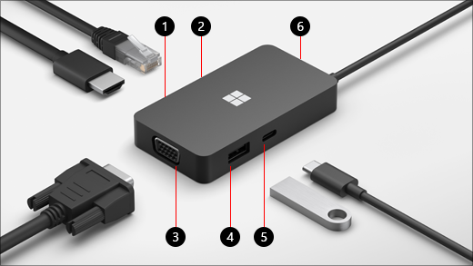

## Other Accessories

I have also some other accessories like the Microsoft Wireless Display Adapter, The USB-C Network Adapter, but also some USB Network Adapter, USB to HDMI Adapters.

## Surface Laptop Studio

My next device will be a Surface Laptop Studio, when I was in June in Redmond at the Microsoft Campus I seen a fellow and Friend MVP with it and looks very good.

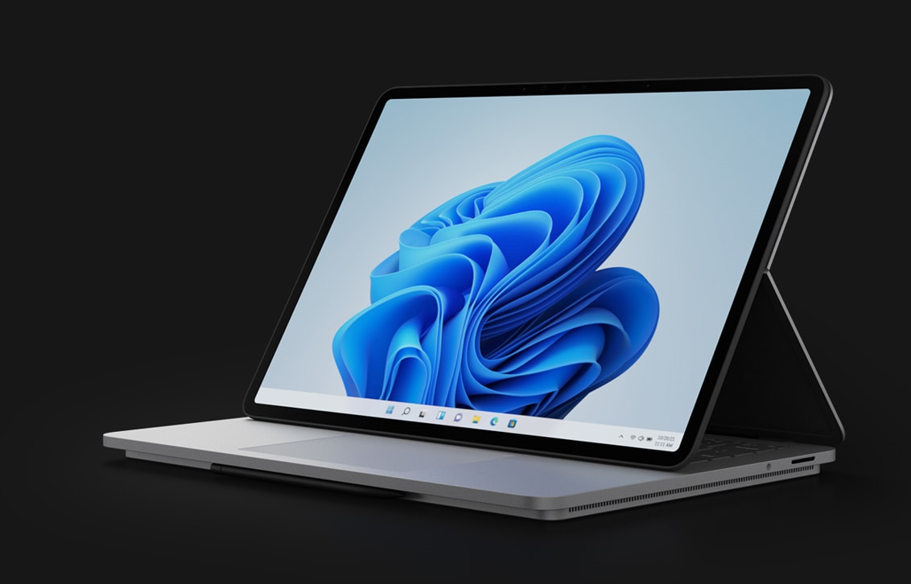

## Conclusion

As you can see I am a real Surface lover and fanboy as people call me. But why not the quality is right it all has the same style.
