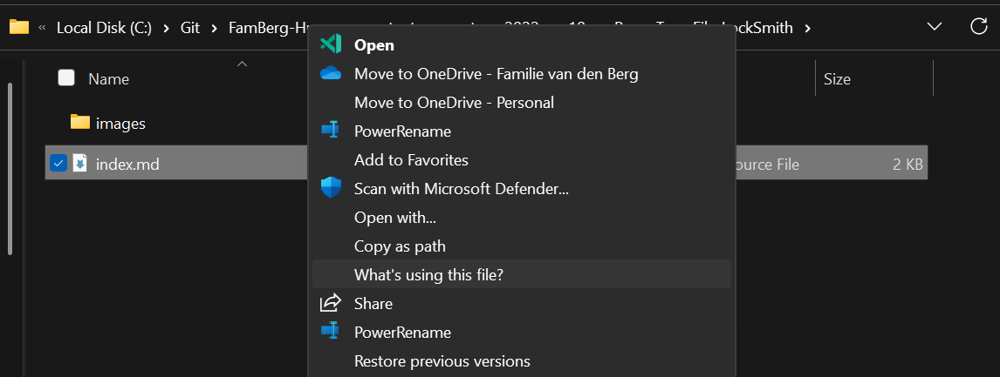
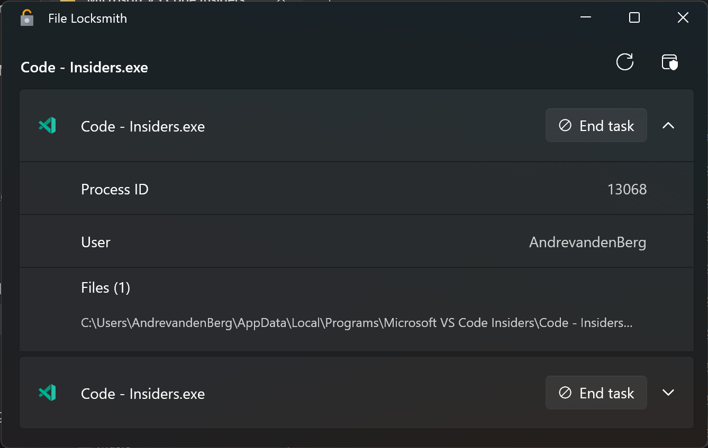
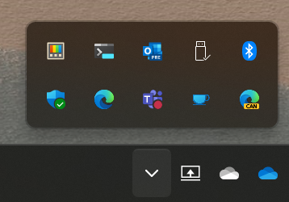
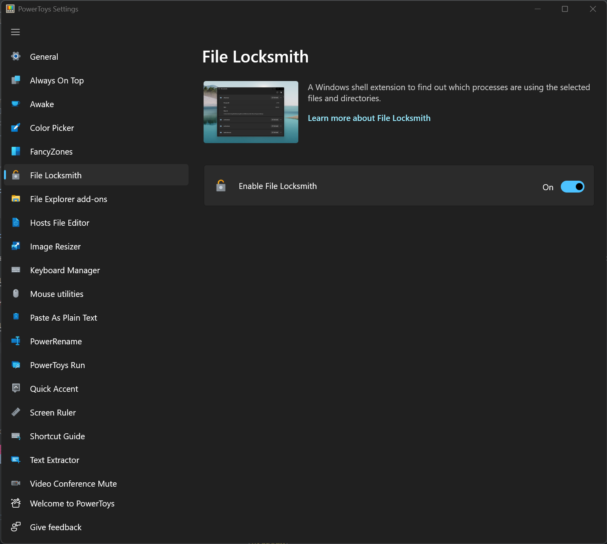

## Handy tool for finding which process keeps your file in use

PowerToys have a new handy tool that you helps to find fast the process that holds your file hostage when you want to delete it for example. Just by right clicking on it and choose for 'What's using this file?'

And then you get a nice screen with the process that is holding your file hostage.

### How to activate it

On the taskbar you click on the ^ (Hidden Taskbar Icons) and then double click on PowerToys icon.

You will get the PowerToys configuration screen and click here on the left on 'File LockSmith'

Here you can Enable or Disable it.
