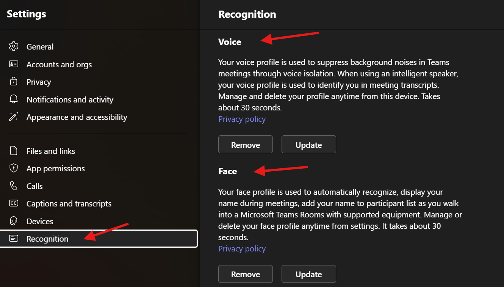

## **Voice and Face Enrollment in Microsoft Teams**

Microsoft Teams continues to evolve, offering new features and enhancements to improve collaboration and productivity. One such feature that has gained attention is **voice and face enrollment**. In this blog post, we'll explore what it is, how it works, and its benefits.

## **What is Voice and Face Enrollment?**

Voice and face enrollment is a feature within Microsoft Teams that allows users to create personalized voice and face profiles. These profiles enhance the audio quality during Teams meetings and calls, reduce background noise, and improve the overall user experience.

## **Overview:**

- **Enrollment Process:**
  - Users can enroll their voice and face profiles through the Teams Desktop app.
  - First, they enroll their voice, and then they can proceed to enroll their face.
  - Removing the voice profile automatically removes the associated face profile, but removing the face profile leaves the voice profile intact.
  - Users can delete their voice and face profiles at any time, even if the enrollment policy is turned off.
- **Supported Languages:**
  - The language of the Teams app installed determines the voice enrollment languages available to users.
- **Purpose:**
  - Microsoft uses voice and face profiles solely for providing the voice and face enrollment feature in Teams. These profiles are not used for training models or any other purposes.
- **IntelliFrame and Intelligent Camera:**
  - Teams Rooms equipped with Microsoft Multi-Stream IntelliFrame certified devices can recognize users' faces and voices. These devices include AI cameras that track facial movements and gestures, enhancing the meeting experience.
- **Automatic Recognition:**
  - Once users create a Recognition profile, supported cameras can automatically recognize them in any meeting without further action.

## **How Does It Work?**

1. **Enrollment Process:**
   - Users can enroll their voice and face profiles through the Teams Desktop app.
   - First, they enroll their voice by recording a sample phrase. Then, they proceed to enroll their face by capturing images.
   - Removing the voice profile automatically removes the associated face profile, but removing the face profile leaves the voice profile intact.

2. **Supported Languages:**
   - The language of the Teams app installed determines the voice enrollment languages available to users.

3. **Purpose and Privacy:**
   - Microsoft uses voice and face profiles solely for providing the voice and face enrollment feature in Teams. These profiles are not used for training models or any other purposes.
   - Admins can manage and configure voice and face enrollment settings for specific users or groups.

4. **IntelliFrame and Intelligent Camera:**
   - Teams Rooms equipped with Microsoft Multi-Stream IntelliFrame certified devices can recognize users' faces and voices. These devices include AI cameras that track facial movements and gestures, enhancing the meeting experience.

5. **Automatic Recognition:**
   - Once users create a Recognition profile, supported cameras can automatically recognize them in any meeting without further action.

## **Benefits of Voice and Face Enrollment:**

- **Improved Audio Quality:** Voice profiles help reduce background noise and enhance audio clarity.
- **Speaker Identification:** Teams can identify speakers during meetings, making it easier to follow conversations.
- **Privacy Controls:** Users have control over their profiles and can delete them at any time.
- **Enhanced Meeting Experience:** IntelliFrame-equipped cameras improve video quality and tracking.

## **Activating Voice and Face Enrollment in Microsoft Teams with PowerShell**

Microsoft Teams offers a powerful feature called **voice and face enrollment**, which enhances collaboration and meeting experiences. By enabling this feature, users can create personalized voice and face profiles for improved audio quality and speaker identification. Let's dive into how you can activate it using PowerShell.

How will it look in Teams onder settings before you enabled the option:


## **Step-by-Step Guide**

1. **Open PowerShell:**
   - Launch PowerShell with administrative privileges.

2. **Connect to Microsoft Teams:**
   - Run the following command to connect to Microsoft Teams:

     ```powershell
     Connect-MicrosoftTeams
     ```

3. **Enable Voice and Face Enrollment:**
   - Execute the following command to enable voice and face enrollment for a specific user (replace `<UserPrincipalName>` with the actual user's UPN):

     ```powershell
     Set-CsTeamsIPPhonePolicy -Identity Global -AllowUserEnrollment $true
     ```

4. **Verify the Policy Settings:**
   - Confirm that the policy settings have been updated:

     ```powershell
     Get-CsTeamsIPPhonePolicy | Select-Object AllowUserEnrollment
     ```

5. **Restart Teams:**
   - Restart the Teams app on the user's device for the changes to take effect.

6. **Enroll Voice and Face:**
   - In Teams, navigate to **Settings > Devices > Voice and Face**.
   - Follow the prompts to enroll your voice and face profiles.

Remember to adjust the policy settings based on your organization's requirements. If you encounter any issues, refer to the official Microsoft documentation for additional guidance.

## **Enforcing the Policy Organization-Wide**

To enforce the voice and face enrollment policy for all users across your organization, consider the following approaches:

1. **PowerShell Script:**
   - Use PowerShell to apply the policy globally. Connect to Microsoft Teams and set the policy using the appropriate cmdlets.
   - Example:

     ```powershell
     Set-CsTeamsMeetingPolicy -Identity Global -EnrollUserOverride $Enabled
     ```

2. **Admin Center (Bulk Assignment):**
   - Navigate to the Teams admin center.
   - Select the desired users or groups.
   - Edit their settings and enable voice and face enrollment.
   - Apply the changes.

How will it look in Teams under settings after you enabled the option:



## **Configuring Voice and Face Enrollment in Microsoft Teams**

To set up voice and face enrollment as a user in Microsoft Teams, follow these steps:

1. Open the Teams app on your desktop.
2. Go to Settings (usually located in the top-right corner).
3. Navigate to the Recognition section.
4. Enroll your voice profile first by following the prompts
5. Once your voice profile is set up, proceed to enroll your face.
6. Remember that you cannot enroll your face without first enrolling your voice.
7. If you decide to remove your voice profile, your face profile will be automatically removed as well. However, removing your face profile won’t affect your voice profile.
8. Even if the policy for enrollment is turned off, you can still delete your voice and face profiles using the Teams desktop app.

Remember that the language of your Teams app determines the available voice enrollment languages. Enjoy an enhanced Teams experience with voice and face recognition!

## **Links**

[Microsoft Learn - Voice Recognition](https://learn.microsoft.com/en-us/microsoftteams/rooms/voice-recognition)

## **Conclusion**

Voice and face enrollment in Microsoft Teams is a valuable feature that enhances communication and collaboration. As organizations adopt Teams for remote work and virtual meetings, understanding and utilizing this feature can significantly improve the overall experience.

Remember to check your Teams settings and explore this feature to make the most of your collaboration platform! 🚀
